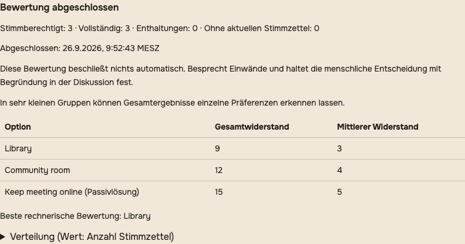
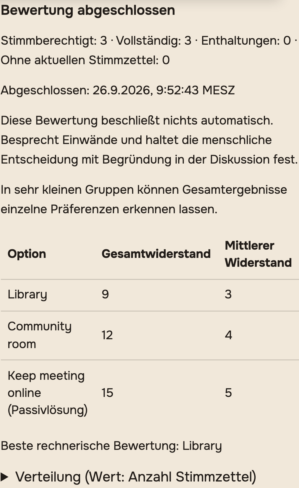

# Native decision rounds and systemic consensus

This increment implements the native architecture selected in
[ADR 0002](../../adr/0002-native-decision-rounds.md), alongside the integrated
discussion overview from PR #22. It addresses parts of #16 and #17. Local tests
and a database recovery rehearsal pass; this document does not claim pilot
deployment, structured outcomes (#18) or decision exports (#20).

## Use the feature

1. Open a discussion belonging to exactly one private group. The discussion author
   or a current group moderator can prepare a round below the overview.
2. Write the question, alternatives, how the assessment will be used, a deadline
   in the displayed timezone and the minimum number of complete ballots. Choose
   single choice or systemic consensus. SK requires one explicit passive option
   describing what happens without an agreed change.
3. Review the draft. Confirm opening to freeze the question, options, method,
   deadline, threshold and eligible group members. Later joiners wait for another
   round. A removed member loses access; an already accepted ballot remains counted.
4. For SK, explicitly score **every** option from 0 (no resistance) to 10 (maximum
   resistance). Blank is not zero, and 10 is not an automatic veto. A complete
   ballot can be replaced or withdrawn while voting is open. Abstention is a
   separate state and does not meet the complete-ballot threshold.
5. The author/moderator explicitly closes the round and publishes the assessment.
   Closing early requires confirmation. The deadline stops new votes independently;
   it does not schedule automatic closure or send reminders in this increment.
6. Read participation, totals, means and score distributions together. A tie,
   insufficient participation, no ballots or a preferred passive option each have
   a distinct explanation. The ranking does not adopt or execute a decision.
7. Prepare a linked new round when alternatives need improvement. It may reuse
   draft wording, but starts with no ballots. Earlier rounds remain in the history;
   older pages can be loaded in batches of 20.

Ballots are confidential from other members, including moderators. Each member can
retrieve only their own latest ballot; current group members see aggregate results
after closure. Operators retain database access: this is not an anonymous ballot.
Small-group aggregates can reveal preferences, and the UI explains that limitation.
Access is rechecked on reads, commands, refresh and returning to the window. Already
delivered information cannot be recalled from a former member's possession.

## Implementation boundaries

- The existing API, PostgreSQL and web containers serve the feature. There is no
  additional service, identity mapping, queue job or mandatory external provider.
- Dedicated GraphQL types expose rounds and only the caller's ballot. No raw
  electorate, other voters' identities or ballot history is added to ordinary post,
  search, subscription, notification or export payloads.
- Commands lock the discussion then the round. Versions detect competing edits;
  request IDs make retries idempotent after rechecking authorization. The server
  checks wall-clock deadlines after acquiring locks.
- The application appends ballot revisions. A database trigger protects opened
  configuration and terminal round records; this is not tamper resistance against
  an operator with database write access. Deleting the hosting post/group uses
  existing deletion semantics and cascades to its decision data.
- Private decision requests skip GraphQL debug payload logs and exception details.
  The backend telemetry filter also drops matching SDK request bodies and custom
  request contexts. HTTP access logs omit GraphQL query strings.
- Existing proposals and their votes retain their existing behavior. Native mobile
  clients do not have the new controls; this increment targets responsive web.
- Structured outcomes, responsibility and review dates remain #18. Reminders/unread
  activity remain #19; reviewed exports remain #20. Full assistive-technology
  acceptance and pilot deployment are still release gates.

## Verified evidence

All fixtures use synthetic communities and accounts. Use Node 24, Yarn 4,
PostgreSQL/PostGIS and Redis in disposable test infrastructure.

```sh
yarn workspace backend test test/unit/graphql/Decisions.test.js test/unit/graphql/Discussions.test.js --timeout 10000
yarn workspace web test --watchAll=false --runInBand --runTestsByPath src/components/DecisionRounds/DecisionRounds.test.js src/components/DiscussionOverview/DiscussionOverview.test.js src/routes/PostDetail/PostDetail.test.js
yarn workspace web test:e2e:isolated authenticated.decision-rounds.spec.js
node --test test/self-hosting/*.test.cjs
yarn workspace web build
```

- The backend selection passes 25 cases: complete ballots, explicit zero, invalid
  replacement atomicity, abstention/withdrawal, retries/version conflicts,
  concurrent close/vote, a deadline expiring while waiting for a lock, frozen
  configuration, membership changes, GraphQL privacy, single choice and SK edge
  cases, plus discussion overview regressions.
- The full backend selection configured in the browser workflow passes 93 cases,
  including legacy proposal preservation and discussion access/delivery regressions.
- Component tests cover network retry with the same request ID, competing edits,
  membership/moderation revocation, stale responses and navigation. The adjacent
  overview and post-detail tests also pass.
  Together these three suites pass 14 tests. The self-hosting checks also pass,
  including enabled-telemetry and GraphQL debug-log privacy regressions. A real
  Yoga request test verifies its post-execution masking hooks and built-in logger,
  including development responses and concurrent ordinary/private requests.
- The real browser flow passes on desktop Chromium and mobile Chrome with three
  voters and an outsider. It checks keyboard entry, replacement/withdrawal/
  abstention, revocation, reload persistence, all six locales and a second empty
  round. The reference result is **A=12, B=9, passive=15** from the same three
  complete ballots, with no result shown before closing.
- Migration and fresh-snapshot tables, constraints, indexes and triggers match.
  The local release rehearsal used the non-superuser application role: upgrade
  legacy content, write rounds and ballot revisions, rerun migrations, back up,
  restore into another database and recompute identical results. It also restored
  the pre-upgrade database and verified that baseline.
- The Docker and browser CI workflows include these checks. Require successful
  runs for the exact release revision; local checks do not replace full CI.





## Upgrade and recovery

Migration `20260926090000_decision_rounds.js` adds five tables: rounds, electorate,
ballot revisions, command receipts and lifecycle events. Fresh bootstrap includes
the equivalent schema and fingerprint. Existing installations must run normal
migrations, never bootstrap or reseed.

1. Integrate with PR #22's self-hosting/discussion baseline. Require green Docker
   and browser workflows for the exact revision and build immutable images.
2. Follow the [coordinated rollout procedure](discussion-rollout.md): close writes,
   stop API/worker/scheduler publishers, retain the previous images/configuration,
   and take a recoverable database plus media/queue/secret backup.
3. Rehearse the upgrade on an isolated restored copy with external delivery
   disabled. The CI-only `test/self-hosting/discussion-release.sh` harness is
   destructive, guarded for disposable CI projects, and must not target an operator
   installation. It now verifies decision history in addition to discussion history.
4. Run normal migrations, start API/web/worker together and reconnect clients.
   Check existing local/community login and registration policy, then complete a
   synthetic private-group round with three voters and an outsider through HTTPS.
   Verify revocation, second-round history and the reference totals after reload.
5. Retain additive decision tables for an application-only rollback. Migration
   `down` destroys decision history and is not a safe operational rollback. If a
   database restore is necessary, keep writes closed and use a compatible snapshot
   with the previous images; preserve any intervening user data for reconciliation.

The rehearsal verifies database recovery, including ballot revisions and receipts.
It does not verify uploaded file bytes, Redis queues/sessions or secret storage;
complete instance recovery remains #8. Keep #16/#17 open until their applicable
release acceptance is complete.

## Optional AI assistance

[The feature assessment](../ai-assistance.md) identifies neutral draft wording,
duplicate-option review and explanations of the passive option as possible future
assistance. Each requires scoped input and human review before opening. Frozen
wording and private ballots must not be sent to an assistant for automatic changes,
inferred votes or adoption. No AI provider or data transmission is implemented.
