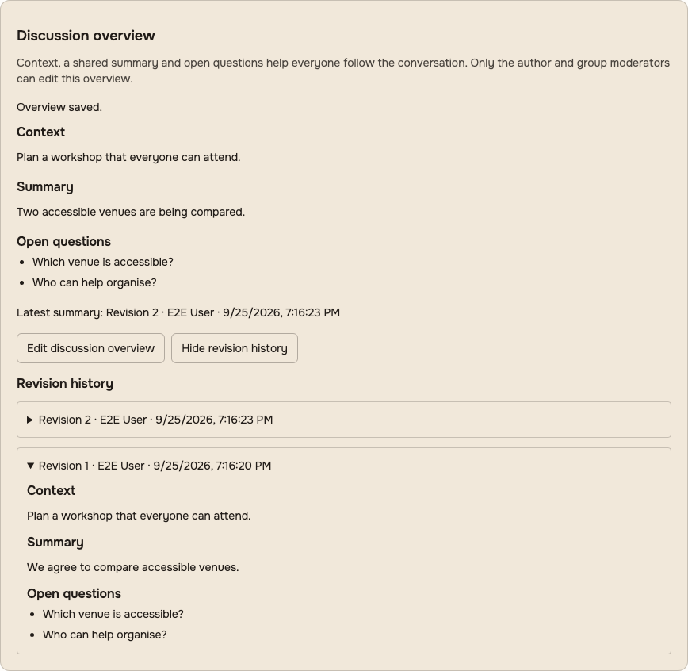
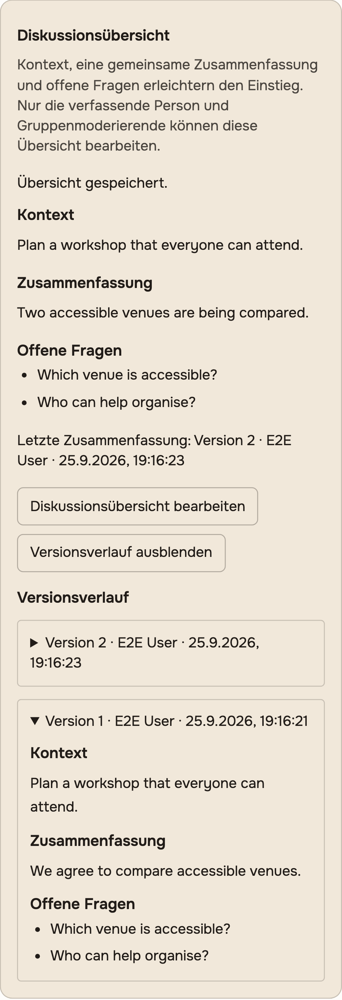

# Discussion overview: review and integration notes

This implements the context/summary increment of #14 in draft PR #21. It is web
functionality on the development branch, not a deployment or a claim that the
whole community decision workflow is complete.

## Behavior

- An existing discussion starts with a readable context imported from its rich
  text, including link destinations. The original post body, IDs, attachments,
  comments and reply links remain unchanged.
- The author or an active group moderator can maintain context, a separate
  summary and up to 30 open questions. Other current members can read and use the
  existing comment/reply flow. Parent moderators can manage a space's overview
  only while their parent membership, group and role assignment remain active.
- Each changed save appends an attributed, timestamped revision. Readers can
  inspect history in pages of 20. Context-only edits do not move the latest-summary
  marker. An identical save creates no extra revision.
- Concurrent edits use an expected version and a transaction lock. A stale edit
  keeps its draft and asks the editor to reconcile it with the latest revision.
- All six existing locales have translated labels. The form has labelled inputs,
  keyboard navigation, focus restoration and narrow-layout coverage. The existing
  comment send button now has an accessible name.
- A late saved-draft response no longer replaces a comment or reply that the
  participant has already typed or cleared. Untouched composers still restore
  saved drafts. This race was reproduced with the actual Tiptap editor before
  the fix; the regression cases control only the asynchronous draft result.

## Access boundary and remaining release gate

The new overview, mutation and history endpoints check active membership on every
request. A retained post follow or inactive moderator assignment grants no access.
Returning to the browser window rechecks permission and removes the overview if
membership was revoked. Data already read cannot be retroactively removed from a
user's possession; there is no new live revocation subscription.

Overview revisions are intentionally member-only, even for a public original
post. They are not fields on the general `Post` type, are not added to search or
subscription payloads, and do not appear in public metadata. This is an explicit
first-increment boundary; public guest access needs a separate policy.

The ordinary post/comment paths now also reject a former member's retained follow
as permission to read, reply to or edit a private discussion. Direct GraphQL reads
and anonymous comment reads check post visibility. Replies must reference an active
parent in the same post; old malformed cross-post links do not reveal the parent.
Full-text search intersects requested group IDs with current membership rather
than treating the requested scope as permission. GraphQL comment and typing
subscriptions check access before opening a channel and again for each event;
post events on `postUpdates` and `allUpdates` also recheck current access.

Private discussion comments and typing events on legacy Socket.IO now target
personal post rooms belonging to current active members. Room membership is no
longer the access grant: each send reloads post visibility and current recipients.
This covers retained rooms, inactive users/groups/posts, and a public discussion
becoming private. Membership in another active linked group still grants access.
Typing mutations check access before publishing, including comment-thread typing.

Queued email, push and in-app discussion notifications reload their activity and
source access at delivery. Direct in-app delivery and notification events on
`updates`/`allUpdates` also check current access. Comment digests exclude inactive
comments and recheck each recipient before sending; a retained follow is
insufficient for a private discussion. Empty digest batches return a numeric zero.

Persisted notifications and direct activity reads now apply recipient and source
visibility before pagination, including totals. Nested post/comment getters read
fresh content instead of reusing schema-level relation caches. Deleted sources and
inactive recipients are excluded; unrelated activities without a source are retained.

Private `newPost` events in both group and parent-space channels use personal group
rooms and current authorization. Creation publishes only after its transaction
commits. Overview, post/comment reads, search, notifications and socket delivery
share the active membership/moderation policy, including inherited space moderators.
A site-administrator session alone does not grant private discussion membership.
Editing/deletion, comment deletion, bookmarks, reactions and the covered pin/remove
paths check current discussion permission. Reactions reject deleted comments and
posts; ordinary private-message behavior remains covered.

The review reproduced failures in persisted activity visibility, cached content,
group broadcasts and inherited moderation, then added regression cases before the
fixes. Adjacent tests also caught SQL NULL handling for older untyped posts; the
shared restriction preserves those non-discussion paths. Notification fixtures now
set the recipient as production Activity.createNotifications does.

The #14 release gate still requires the integrated deployment and complete CI on
that revision. These tests document bounded discussion paths; they are not an audit
of every existing Hylo endpoint or a guarantee against all concurrent permission
changes. Already delivered data cannot be recalled.
Native mobile clients, full assistive-technology testing and production integration
are also not claimed by this change.

## Validation and reproduction

Use isolated synthetic data only. The browser fixture rejects execution without
`E2E_ISOLATED=1` and a database whose name contains `e2e`; the existing runner
creates and drops that database. Never point it at a populated installation.

With the repository's test PostgreSQL/PostGIS, Redis, Node 24 and Yarn 4 setup:

```sh
yarn workspace backend test test/unit/models/ProposalOptionPreservation.test.js test/unit/graphql/Discussions.test.js test/unit/graphql/DiscussionAccess.test.js test/unit/graphql/DiscussionDelivery.test.js test/unit/graphql/DiscussionRemainingAccess.test.js --timeout 10000
yarn workspace web test --watchAll=false --runInBand --runTestsByPath src/components/PostEditor/PostEditor.test.js src/components/DiscussionOverview/DiscussionOverview.test.js src/routes/PostDetail/PostDetail.test.js src/routes/PostDetail/Comments/CommentForm/CommentForm.test.js
yarn workspace web test:e2e:isolated authenticated.discussion-overview.spec.js --project=chromium --project=mobile-chrome
yarn workspace web build
```

The focused backend tests cover real PostgreSQL persistence, legacy content and
attachment preservation, moderator attribution, revoked users and inherited roles,
simultaneous edits, history pagination, GraphQL permissions and migration up/down.
Access regression tests exercise the actual GraphQL schema and full-text index,
retained follows, scoped search, cross-post parent links and subscription streams
before and after membership revocation. Public discussions and private message
participants have positive regression coverage too.
Delivery regression tests additionally exercise real Socket.IO clients, the Sails
room helpers and Redis worker emitter, using ordered event barriers instead of
sleep-based absence checks. Database-backed cases cover queued notifications,
live notification streams, comment digests and positive delivery to current
members/public readers. Transport testing also reproduced an existing worker
shutdown error: the emitter's Redis client has a callback-based `quit`, not a
Promise-based API; cleanup now uses that API.

The focused backend selection passes 82 tests, including 26 delivery cases and
24 persisted-access/moderation cases. Another 117 existing notification, comment,
post, search and REST-policy tests pass locally, with one existing search skip.
Legacy CommonJS tests require Mocha's synchronous loader because its default ESM
import path conflicts with `mock-require` on the tested Node 24 runtime. No
test-runner dependency change is included here. The preceding access increment
also passed 36 adjacent visibility/search/inbound-comment tests with one existing
search skip.
Component tests cover rendering, editing, conflicts, request failures, history and
revocation, as well as late comment-draft restoration, without replacing the
server-side permission tests.

Three independent browser scenarios cover author editing/history/locales,
participant replies/direct links/revocation, and outsider denial. Each creates its
own database-backed fixture. Splitting the previous serial scenario isolates
failures and avoids sharing one timeout across all three workflows. All six
desktop/mobile scenarios plus auth setup passed locally with two configured
workers; that does not replace the full CI suite. Secondary participant contexts
use the project's mobile user agent and touch settings as well as viewport size.
The full GitHub workflow for the preceding revision `21b231eec` passed. The new
persisted-access selection is added to that workflow and needs its own successful
run on this revision.
Screenshots below use
the actual device width and a taller capture viewport to show the entire panel.





## Migration and rollout

`20260925120000_discussion_revisions.js` adds an append-only revision table with
post/version primary key and post/author foreign keys. The schema snapshot also
contains the table for clean installations. Legacy descriptions are imported on
read until the first save; the migration does not rewrite existing posts.

Before a production rollout:

1. Integrate this feature with the current deployment work in #10. Reconcile its
   bootstrap migration ledger and schema fingerprint with the changed snapshot;
   do not replace the deployed branch with this development branch.
2. Back up the database and test the upgrade on a restored copy, then check
   author/member/moderator access and history with representative data.
3. Apply the migration before serving the new API and web bundle. Run the focused
   checks and the complete CI suite on that exact integrated revision.
4. Restart every API and worker process together so no old publisher keeps sending
   private discussion events to shared rooms. Existing clients must reconnect and
   rejoin both shared and personal post/group rooms. A mixed-version rollout does not
   provide the new delivery boundary.
5. Verify backup/restore includes discussion history. For application rollback,
   retain the additive table. Running the migration's `down` drops all saved
   overview revisions and is not a nondestructive rollback.

## AI assessment

[The ongoing assessment](../ai-assistance.md) records possible summary drafts,
open-question extraction, reading guides and neutral option descriptions. None is
implemented or sends data to a provider. Source selection, citations, provenance,
access checks and explicit human review are prerequisites for a future assistant.
Resistance values, votes and binding outcomes remain human decisions.
The access review also identifies a future requirement: recheck source permission
when gathering inputs, releasing a generated draft and opening it later. An
existing subscription or search result must never serve as a permanent access grant.
