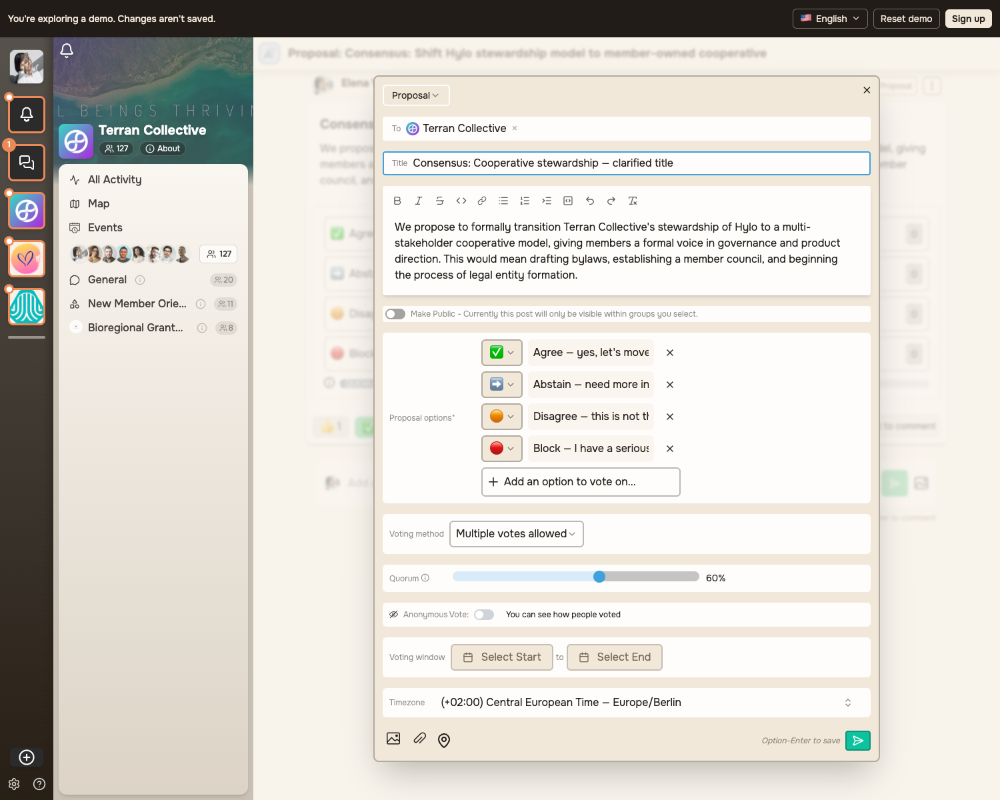

# Proposal edit browser check

The production web build was inspected with Playwright in the existing `/sandbox`
demo on 2026-09-25. This verifies the visible editor states with synthetic demo
data; it does not verify database persistence. The PostgreSQL regression tests
cover persistence separately.

1. Change only the title of an existing proposal. The vote-reset warning is absent.
2. Change one option's text. The vote-reset warning appears below the options.

The demo's existing consensus template is unrelated to the planned SK method.
These images do not show a new decision-round or systemic-consensus feature.
